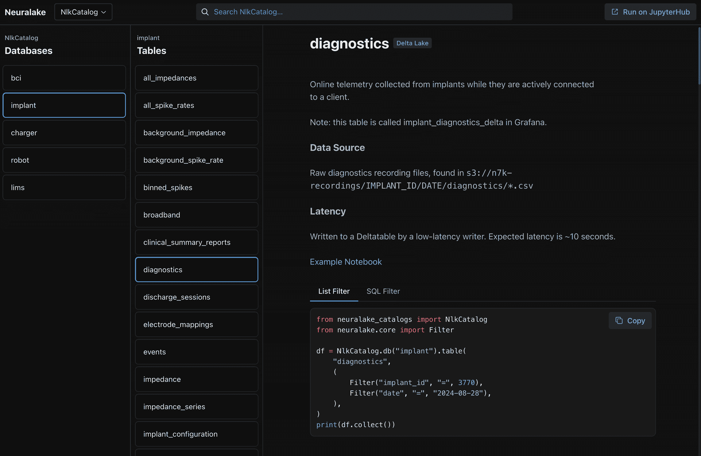

<!-- Using CSS to hide this on the site, as the logo is already on the nav.-->
<div align="center" class="github-only">
    
    <br>
    <a href="https://data-repo.io">
        
    </a>
    <a href="https://pypi.org/project/data-repository/">
        
    </a>
</div>

# datarepo: a simple platform for complex data

`datarepo` is a simple query interface for multimodal data at any scale.

With `datarepo`, you can define a catalog, databases, and tables to query any existing data source. Once you've defined your catalog, you can spin up a static site for easy browsing or a read-only API for programmatic access. No running servers or services!

The `datarepo` catalog has native, declarative connectors to [Delta Lake](https://delta.io/) and [Parquet](https://parquet.apache.org/) stores. `datarepo` also supports defining tables via custom Python functions, so you can connect to any data source!

Here's an example catalog:

<div class="github-only">
    
</div>

<!-- The below comment is replaced by a mkdown hook to insert an iFrame catalog -->
<!-- this is done via hooks because we can't show the iFrame on GitHub, but want to show it on the static site. -->
<!-- mkdocs:iframe -->

## Key features

- **Unified interface**: Query data across different storage modalities (Parquet, DeltaLake, relational databases)
- **Declarative catalog syntax**: Define catalogs in python without running services
- **Catalog site generation**: Generate a static site catalog for visual browsing
- **Extensible**: Declare tables as custom python functions for querying **any** data
- **API support**: Generate a YAML config for querying with [ROAPI](https://github.com/roapi/roapi)
- **Fast**: Uses Rust-native libraries such as [polars](https://github.com/pola-rs/), [delta-rs](https://github.com/delta-io/delta-rs), and [Apache DataFusion](https://github.com/apache/datafusion) for performant reads

## Philosophy
Data engineering should be simple. That means:

1. **Scale up and scale down** - tools should scale down to a developer's laptop and up to stateless clusters
2. **Prioritize local development experience** - use composable libraries instead of distributed services
3. **Code as a catalog** - define tables *in code*, generate a static site catalog and APIs without running services

## Quick start

Install the package in a virtual environment:

```bash
python3 -m venv .venv
.venv/bin/python -m pip install data-repository
```

Save the following as `local_quickstart.py` and run it with
`AWS_EC2_METADATA_DISABLED=true .venv/bin/python local_quickstart.py` on Linux.
The environment setting prevents EC2 metadata discovery: this version asks boto3
for storage options even for local files. A missing-credentials log is harmless
for this local example. It writes a small synthetic Parquet file,
filters parts, and joins them to a function-backed supplier table. No bucket,
server, account or credentials are needed. Both inputs use equal-length columns;
`part_id` and `supplier_id` are distinct keys.

The runnable source is [examples/local_quickstart.py](examples/local_quickstart.py).
Tests check this embedded source and the displayed output for drift.

<!-- local-quickstart-code -->
```python
"""Run a local Parquet query and join using synthetic data; no credentials needed."""

import json
from pathlib import Path
from tempfile import TemporaryDirectory

import polars as pl

from datarepo.core import Filter, NlkDataFrame, ParquetTable, table


@table
def suppliers() -> NlkDataFrame:
    """Synthetic suppliers, provided as a regular Python function."""
    return pl.LazyFrame(
        {"supplier_id": [10, 20], "supplier_name": ["Supplier A", "Supplier B"]}
    )


def run_example() -> pl.DataFrame:
    with TemporaryDirectory(prefix="datarepo-quickstart-") as directory:
        path = Path(directory) / "parts.parquet"
        pl.DataFrame(
            {
                "part_id": [1, 2, 3, 4],
                "part_name": ["Bolt", "Nut", "Washer", "Bracket"],
                "supplier_id": [20, 10, 20, 10],
            }
        ).write_parquet(path)
        parts = ParquetTable(name="parts", uri=str(path), partitioning=[])

        # Join on the supplier relationship, not on the unrelated part ID.
        return (
            parts(filters=[Filter("part_id", "in", [1, 2, 3])])
            .join(suppliers(), on="supplier_id")
            .select("part_id", "part_name", "supplier_id", "supplier_name")
            .sort("part_id")
            .collect()  # Read the local file before the temporary directory is removed.
        )


if __name__ == "__main__":
    print(json.dumps(run_example().to_dicts(), indent=2))
```

Output captured by running the example:

<!-- local-quickstart-output -->
```json
[
  {
    "part_id": 1,
    "part_name": "Bolt",
    "supplier_id": 20,
    "supplier_name": "Supplier B"
  },
  {
    "part_id": 2,
    "part_name": "Nut",
    "supplier_id": 10,
    "supplier_name": "Supplier A"
  },
  {
    "part_id": 3,
    "part_name": "Washer",
    "supplier_id": 20,
    "supplier_name": "Supplier B"
  }
]
```

The query is collected while the temporary file exists. The original file is
removed automatically when the example exits.

### Create a table module and catalog

A database groups tables from a Python module; a catalog groups databases.
To keep the joined data available for catalog queries and exports, save this as
`local_tables.py` beside `local_quickstart.py`. Importing it writes a small
`parts_and_suppliers.parquet` file beside the module.

<!-- local-catalog-tables -->
```python
from pathlib import Path

from datarepo.core import ParquetTable, PartitioningScheme
from local_quickstart import run_example, suppliers

data_path = Path(__file__).with_name("parts_and_suppliers.parquet")
run_example().write_parquet(data_path)
parts_and_suppliers = ParquetTable(
    name="parts_and_suppliers",
    uri=str(data_path),
    partitioning=[],
    partitioning_scheme=PartitioningScheme.HIVE,
)
```

Save the catalog definition as `local_catalog.py` in the same directory:

<!-- local-catalog-definition -->
```python
from datarepo.core import Catalog, ModuleDatabase
import local_tables

LocalCatalog = Catalog({"local": ModuleDatabase(local_tables)})
```

The database exposes both the persisted Parquet table and the function-backed
`suppliers` table. Query the Parquet table through the catalog:

<!-- local-catalog-query -->
```python
from datarepo.core import Filter
from local_catalog import LocalCatalog

result = LocalCatalog.db("local").table(
    "parts_and_suppliers", filters=[Filter("supplier_id", "=", 20)]
).sort("part_id").collect()
print(result.to_dicts())
```

This returns Bolt and Washer, both supplied by Supplier B. Use the same Linux
environment setting shown above when running these examples.

### Generate a static site catalog

Export the catalog metadata and bundled site assets to a dedicated output
directory. The exporter replaces that directory when run again.

<!-- local-catalog-site -->
```python
from datarepo.export.web import export_and_generate_site
from local_catalog import LocalCatalog

export_and_generate_site(
    catalogs=[("local", LocalCatalog)], output_dir="local-catalog-site"
)
```

### Generate an API configuration

The ROAPI exporter includes supported storage-backed tables. Here it exports
`parts_and_suppliers`; the Python-backed `suppliers` table is omitted. JSON is
also valid YAML, so the standard library can write the configuration:

<!-- local-catalog-roapi -->
```python
import json
from pathlib import Path

from datarepo.export.roapi import export_to_roapi_tables
from local_catalog import LocalCatalog

Path("roapi-config.yaml").write_text(
    json.dumps({"tables": export_to_roapi_tables(LocalCatalog)}, indent=2)
)
```

The generated configuration references the local Parquet file; keep that file
available when running [ROAPI](https://github.com/roapi/roapi). For larger
catalogs, see [the example catalog](examples/tpc_catalog.py) and
[the site generation example](examples/generate_tpc_site.py).

## About Neuralink

`datarepo` is part of Neuralink's commitment to the open source community. By maintaining free and open source software, we aim to accelerate data engineering and biotechnology.

Neuralink is creating a generalized brain interface to restore autonomy to those with unmet medical needs today, and to unlock human potential tomorrow.

You don't have to be a brain surgeon to work at Neuralink. We are looking for exceptional individuals from many fields, including software and data engineering. Learn more at [neuralink.com/careers](https://neuralink.com/careers/).
